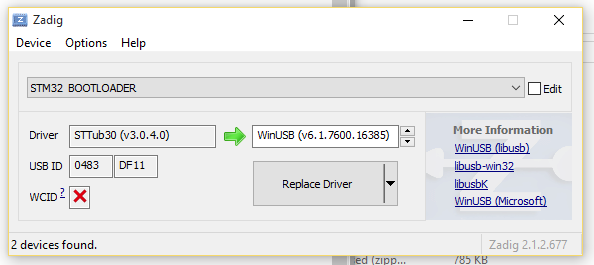

# USB Flashing

Modern flight controllers are typically flashed in USB DFU mode. This is a straight-forward process in Configurator. The standard flashing procedure should work successfully with the caveat of some platform specific matters as noted below.

* If the board is placed in DFU mode manually (by hardware button), then check "No reboot sequence"
* Baudrate is not relevant for DFU flashing.
* For version upgrades, enable "Full chip erase"


## Platform Specific: Linux

Linux requires `udev` rules to allow write access to USB devices for users.


### Simple unconditional rule

The simplest rule is to allow DFU access unconditionally; this avoids having to set up specific groups which may be distro independent. If you have previously flashed OpenTX or EdgeTX you will already have such a rule as `/etc/udev/rules.d/45-companion-taranis.rules` and no further action is required. Otherwise, you can add (as root) a file for example `/etc/udev/rules.d/45-stdfu-permissions.rules` containing the single line:

```
SUBSYSTEMS=="usb", ATTRS{idVendor}=="0483", ATTRS{idProduct}=="df11", MODE:="0666"
```

### More complex group example

As an alternative, you can make a distro specific rule restricting DFU a group; an example shell command to achieve this on Ubuntu is:

```
(echo '# DFU (Internal bootloader for STM32 MCUs)'
 echo 'SUBSYSTEM=="usb", ATTRS{idVendor}=="0483", ATTRS{idProduct}=="df11", MODE="0664", GROUP="plugdev"') | sudo tee /etc/udev/rules.d/45-stdfu-permissions.rules > /dev/null
```

This assigns the device to the `plugdev` group(a standard group in Ubuntu). To check that your account is in the `plugdev` group type `groups` in the shell and ensure `plugdev` is listed. If not you can add yourself as shown (replacing `<username>` with your username):
```
sudo usermod -a -G plugdev <username>
```
Then log out and back again to acquire the new group.

On Arch and its derivatives the group would be `uucp` (in the rule and the `usermod` command:
```
sudo usermod -a -G uucp <username>
```

## Platform Specific: Windows

The Configurator can have problems accessing USB devices on Windows. A driver should be automatically installed by Windows for the ST Device in DFU Mode but this doesn't always allow access. One solution is to replace the ST driver with a libusb driver. The easiest way to do that is to download [Zadig](http://zadig.akeo.ie/).
With the board connected and in bootloader mode (reset it by sending the character R via serial, or simply attempt to flash it with the correct serial port selected in Configurator):

* Open Zadig
* Choose Options > List All Devices
* Select `STM32 BOOTLOADER` in the device list
* Choose `WinUSB (v6.x.x.x)` in the right hand box
   


* Click Replace Driver
* Restart the Configurator (make sure it is completely closed, logout and login if unsure)
* Now the DFU device should be seen by Configurator

## While Using USB-C cables

* If you are using a device with only USB-C ports such as a Mac-OS device, you will need a dongle.
  * A USB-C to USB-C cable is identical on both ends and thus requires extra hardware to let them be auto detected as devices instead of hosts.
  * This is __can__ by using a USB-C female to USB-C male dongle; **However** a USB-C to USB-A cable with a dongle works best as USB-A always sends power while USB-C needs the device to request it.
    
## Using `dfu-util`

`dfu-util` is a command line tool to flash ARM devices via DFU. It is available via the package manager on most Linux systems or from [source forge](http://sourceforge.net/p/dfu-util).

Put the device into DFU mode by **one** of the following:

* Use the hardware button on the board
* Send a single 'R' character to the serial device, e.g. on POSIX OS using `/dev/ttyACM0` at 115200 baudrate.

```
stty 115200 < /dev/ttyACM0
echo -ne 'R' > /dev/ttyACM0
```
* Use the CLI command `dfu`

It is necessary to convert the `.hex` file into `Intel binary`. This can be done using the GCC `objcopy` command; e.g. for the notional `inav_x.y.z_NNNNNN.hex`.

```
objcopy -I ihex inav_x.y.z_NNNNNN.hex -O binary inav_x.y.z_NNNNNN.bin
```

You can now DFU flash the `.bin` file:

```
dfu-util -d 0483:df11 --alt 0 -s 0x08000000:force:leave -D inav_x.y.z_NNNNNN.bin
```
or with full erase

```
dfu-util -d 0483:df11 --alt 0 -s 0x08000000:mass-erase:force:leave -D inav_x.y.z_NNNNNN.bin
```

## Caveats

Once the board is placed in DFU mode, the hardware boot loader polls for activity on the USB device and *some MCU dependent* UARTS (often UART1 and UART3). If you have a device on one of these UARTS that transmits unconditionally (GPS, RX for example), then that port may win the "active device" race, and DFU flashing will fail.

Ensure that such devices are either disconnected or not powered during flashing.

## Older devices / broken USB ports

If you have a older (unsupported) FC that does not support DFU, or a modern board with a broken USB port, it is possible to flash the board via a UART (typically UART1) using the ST serial flashing protocol.


This is supported by (very) old Configurators, the open source [stm32flash](https://sourceforge.net/projects/stm32flash/) tool and some ST proprietary tools.

Examples:

* Erase the device (assumed `/dev/ttyUSB0`)

```
stm32flash -o -b 57600 /dev/ttyUSB0
```
* Flash a HEX file (notionally `inav_x.y.z_NNNNNN.hex`)

```
stm32flash -w inav_x.y.z_NNNNNN.hex -v -g 0x0 -b 57600 /dev/ttyUSB0
```

replace `/dev/ttyUSB0` as appropriate for your OS. You will probably be more successful at 57600 baud than 115200. The speed is auto-detected by the FC.
